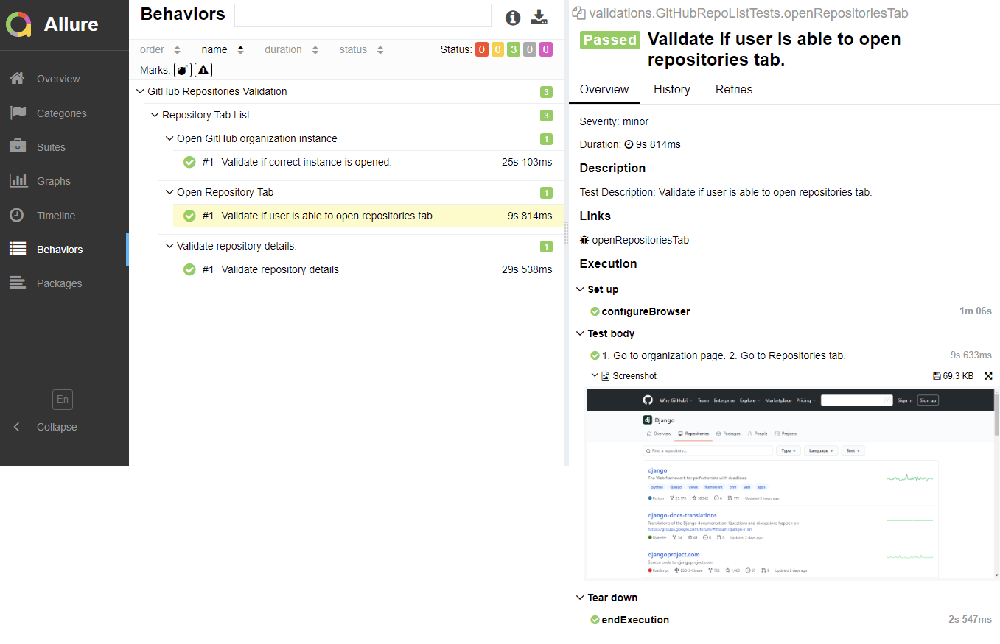
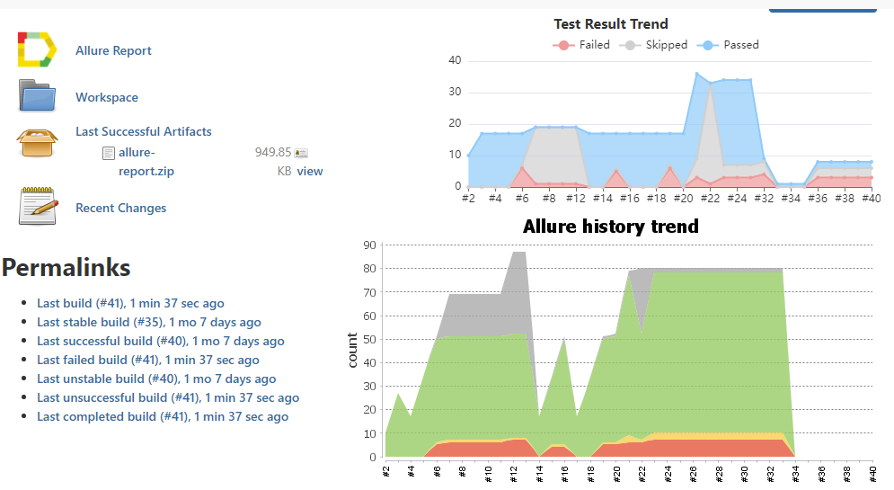

# Goal
Validate names and descriptions of repositories displayed in repository tab of GitHub for provided organization. Default organization is set to `django` Comparison will be between the data shown on UI and data received in respective API response. 


  >**Index**
  * [Project Configuration](#project-configuration)
  * [PageObjects Pattern](#pageobjects-pattern)
  * [Object Repository](#object-repository)
  * [Configuration Handler](#configuration-handler)
  * [Build Automation Using Maven](#build-automation-using-maven)
  * [Utilities](#utilities)
  * [Logging Mechanism](#logging-mechanism)
  * [HTML Reporting](#html-reporting)
  * [CICD Configuration](#cicd-configuration)
  * [Known Limitations](#known-limitations)

## Project Configuration
This project is based out of Selenium WebDriver and TestNG. Additionally, you would need to have following apps / libraries configured on the machine where test would be run.
- [Apache Maven 3.5+](https://maven.apache.org/)
- [Java 8u171+](https://oracle.com/java/technologies/javase/javase8-archive-downloads.html)
- [Allure](https://docs.qameta.io/allure/#_installing_a_commandline)
- > After installing above, make sure you have three environment variables set in your local machine - `${JAVA_HOME}`,`${M2_HOME}`,`${ALLURE_HOME}`
- Currently Google Chrome, Mozilla Firefox and Microsoft Edge are supported.
- Project is validated on below versions of browsers and respective driver executables on Windows 10 Profession (64-bit)
- #### Validated Browser and executables
| Broser | Browser Version | Driver Version |
| ------ | ------ | ------ |
| Google Chrome |92.0.4515.131 | 92.0.4515.43 (8c61b7e2989f2990d42f859cac71319137787cce-refs/branch-heads/4515@{#306}) |
| Mozilla Firefox | 90.0.2 (64-bit) | 0.29.1 (970ef713fe58 2021-04-08 23:34 +0200) |
| Microsoft Edge | 92.0.902.62 | MSEdgeDriver 92.0.902.55 (2f31ea24c029d582f5472682b25153751b8021b3) |

## PageObjects Pattern

* Page Object is a Design Pattern is implemented to retrieve the data and perform validations.
* Separate page object is created for each page class to reduce code duplication by separating Page Objects and Test Scripts. In current requirement, 
* For example,


**Page Element** 
```java
public class PageCore implements UIElementsImpl {
    public WebDriver driver;
    public WebDriverWait driverWait;
  public WebElement fluentWaitWithCustomTimeout(String locatorKey, int timeout) throws TimeoutException {
    By waitElement = locatorParser.getElementLocator(locatorKey);
    Wait<WebDriver> fluentWait = new FluentWait<>(driver)
            .withTimeout(Duration.ofSeconds(timeout))
            .pollingEvery(Duration.ofSeconds(1))
            .ignoring(NoSuchElementException.class, TimeoutException.class);
    return fluentWait.until(driver -> driver.findElement(waitElement));
  }
}
```
**Page Object**
```java
public class GitHubRepoList extends PageCore {
    private static final Logger LOGGER = LogManager.getLogger(GitHubRepoList.class);

    public WebElement displayRepositoryTabForOrg() {
        return fluentWaitWithCustomTimeout("repositoriesTabForOrg", 3);
    }

    public boolean verifyIfNoRepositoriesPresent() {
        return driver.findElement(locatorParser.getElementLocator("noReposPresent")).isDisplayed();
    }
}
```
**Test Class**
```java
public class GitHubRepoListTests extends TestCore {
    private static final Logger LOGGER = LogManager.getLogger(GitHubRepoListTests.class);

    @Test(priority = 0)
    public void openInstance() {
        GitHubRepoList gitHubRepoList = new GitHubRepoList(driver);
        String org = gitHubRepoList.getOrg();
        gitHubRepoList.openInstance();
        String title = gitHubRepoList.getTitleOfPage();
        Assert.assertTrue(title.contains(org.substring(1, 3)));
        LOGGER.info("Correct instance is opened: " + gitHubRepoList.getCurrentURL());
    }
}
```

## Object Repository

* This is centralized storage of locators. We are storing locators as objects using Java Properties
* This helps to reduce maintenace of page classes whenever there is any slightest to major change.

```properties
searchRepoField=id!your-repos-filter
repositoryNameInRTab=xpath!.//h3[contains(@class,'wb-break-all')]
repositoryDescription=css!div.flex-auto > p
reposWithDesc=xpath!.//*/preceding-sibling::h3
profileImage=xpath!.//a[contains(@itemprop,'image')]
```
* Locator type is determined at runtime based on the parsed value from object respository. For example, If value contain string `xpath` then element will be located by XPATH.  
* If there is any change in UI, we need to add/modify respective locators at one location only


## Configuration Handler
* Default configuration is provided using properties file.
* Program execution will be proceeded with user provided input. If no input is provided, program would read input from properties file and proceed.

 For example,
```properties
org=django
browser=chrome
```
```java
public class Org {
public String getOrg() {
    String org = System.getProperty("org");
    if (org == null || org.isEmpty())
      org = getPropertyValue("org");
    return org;
    }
}
```


## Build Automation Using Maven 
* Project uses Maven as build management tool.
* Dependency versions are stored as `${env}` variables for easy maintenance. For example
```xml
<dependency>
      <groupId>org.seleniumhq.selenium</groupId>
      <artifactId>selenium-java</artifactId>
      <version>${selenium-java.version}</version>
</dependency>
```
* Run project by executing below commands in project's root directory where `pom.xml` is located. 
  For example,
> For default configuration. This will read inputs from properties file. Default **organization** and **browser** is set to **django** and **Google Chrome** respectively.
> 
  > `mvn clean install`

> For custom configuration. This will proceeds with user provided inputs.
>
> `mvn clean` -Dbrowser="firefox" -Dorg="apache" `install`

> If org is not provided, execution will proceed with default org on provided browser in this case.
> 
> `mvn clean` -Dbrowser="edge" `install`

## Utilities

* Utility to invoke API, read the response, parse it and store it. **RestAssured** library is used to perform the operations.
* In current requirement, `/orgs/<organization>/repositories` GitHub API is invoked and its response is parsed and stored.

```java
public class ResponseParser {
    private static final Logger LOGGER = LogManager.getLogger(ResponseParser.class);
    String endpoint;

    public Response getRepositoryNameAndDescriptionFromAPI(String org) {
        endpoint = "https://api.github.com/orgs/" + org +
                "/repos?type=all&sort=pushed&page=1&direction=full_name&order=asc";
        Response response = given().
                when().get(endpoint).
                then().extract().response();
        return response;
    }
}
```

## Logging Mechanism

* **log4j2** framework is used to log application logs
```xml
<?xml version="1.0" encoding="UTF-8"?>
<Configuration status="INFO">
    <Appenders>
        <RollingFile name="Error_RollingFile" fileName="${baseDir}/${error}.log" immediateFlush="false"
                     append="true" filePattern="${baseDir}/archives/${error}-%d{yyyy-MM-dd}-%i.gz">
            <PatternLayout pattern="%d{yyyy-MM-dd HH:mm:ss.SSS} [%t] %-5level %logger{36} - %msg%n"/>
            <Policies>
                <SizeBasedTriggeringPolicy size="20 MB"/>
            </Policies>
        </RollingFile>
    </Appenders>
    <Loggers>
        <Root level="INFO">
            <AppenderRef ref="Error_RollingFile" level="ERROR"/>
        </Root>
    </Loggers>
</Configuration>
```
* Size limit too placed on logs file using size-based policies. After reaching 20 MB size, log file will be archived at same location.
* Logs are generated in project's root directory, (info.log and error.log) which is `../uiapi` directory, additionally shown in execution console too.
```log
21:31:59.959 [main] INFO  validations.GitHubRepoListTests - Correct instance is opened: https://github.com/django
21:32:05.700 [main] INFO  validations.GitHubRepoListTests - Validating repository description...
21:32:07.089 [main] INFO  pages.GitHubRepoList - No description is shown on UI for the repository: django-contrib-comments
21:32:07.123 [main] INFO  pages.GitHubRepoList - Repository Details from UI: {django=The Web framework for perfectionists with deadlines., django-docs-translations=Translations of the Django documentation. Questions and discussions happen on https://groups.google.com/forum/#!forum/django-i18n, djangoproject.com=Source code to djangoproject.com, daphne=Django Channels HTTP/WebSocket server, django-localflavor=Country-specific Django helpers, formerly of contrib fame, asgiref=ASGI specification and utilities, djangosnippets.org=The code that powers djangosnippets.org, it allows users to post and share useful "snippets" of code., channels_redis=Redis channel layer backend for Django Channels, django-docker-box=Run the Django test suite across all supported databases and python versions, channels=Developer-friendly asynchrony for Django, code.djangoproject.com=Configuration for Django's Trac instance (code.djangoproject.com), deps=Django Enhancement Proposals, ticketbot=Django's IRC ticketbot. Linkifies tickets and changesets. Hangs out in #django and #django-dev., djangobench=Harness and benchmarks for evaluating Django's performance over time, code-of-conduct=Internal documentation of the DSF Code of Conduct committee, djangopeople=A geographical community site for Django developers, asgi_ipc=IPC-based ASGI channel layer, django-box=VM to run the Django test suite. ARCHIVED Please use https://github.com/django/django-docker-box, django-contrib-comments=null}
21:32:35.009 [main] INFO  utilities.ResponseParser - Description is null/empty from retrieved API response for the repository: django-contrib-comments
21:32:35.009 [main] INFO  utilities.ResponseParser - Repository Details from API: {django=The Web framework for perfectionists with deadlines., django-docs-translations=Translations of the Django documentation. Questions and discussions happen on https://groups.google.com/forum/#!forum/django-i18n, djangoproject.com=Source code to djangoproject.com, daphne=Django Channels HTTP/WebSocket server, django-localflavor=Country-specific Django helpers, formerly of contrib fame, asgiref=ASGI specification and utilities, djangosnippets.org=The code that powers djangosnippets.org, it allows users to post and share useful "snippets" of code., channels_redis=Redis channel layer backend for Django Channels, django-docker-box=Run the Django test suite across all supported databases and python versions, django-contrib-comments=null, channels=Developer-friendly asynchrony for Django, code.djangoproject.com=Configuration for Django's Trac instance (code.djangoproject.com), deps=Django Enhancement Proposals, ticketbot=Django's IRC ticketbot. Linkifies tickets and changesets. Hangs out in #django and #django-dev., djangobench=Harness and benchmarks for evaluating Django's performance over time, code-of-conduct=Internal documentation of the DSF Code of Conduct committee, djangopeople=A geographical community site for Django developers, asgi_ipc=IPC-based ASGI channel layer, django-box=VM to run the Django test suite. ARCHIVED Please use https://github.com/django/django-docker-box}
21:32:35.009 [main] INFO  validations.GitHubRepoListTests - Repository description shown on UI matches with that retrieved from the API response.
21:32:35.009 [main] INFO  listeners.TestReportListener - validations.GitHubRepoListTests.validateRepositoryDescriptionWithAPIResponse test is succeeded.
21:32:41.861 [main] INFO  validations.GitHubRepoListTests - Validating repository name...
```
## HTML Reporting

* **TestNG** library and **Allure** is used to generate the test report
* **TestNG** generates HTML report in very basic format. To understand the system health better, **Allure** is implemented, which internally uses Report XMLs generated by **TestNG**
* In order to see HTML report, you would need to execute below command from the location where `allure-results` directory is located. 

> **allure serve** `allure-results`

Below is sample screen for allure report generated


## CICD Configuration
* Allure reporting can be achieved via Jenkins. Allure provides [Jenkins plugin](https://plugins.jenkins.io/allure-jenkins-plugin/).

* Allure provides reporting via Docker as well.
* Both Jenkins and Docker are not implemented and integrated in this project, since both would need publicly accessible Jenkins and Docker instance.

### Known Limitations
* Organization type = User account might work in ambiguous way than org=company. For example, if org=shekharsvbhosale, then some tests might fail. No validation for detecting org type is implemented. This matters because repository tab URL changes based on this type.However, considering given requirement, this would work for any public organization. For example, org=apache or org=microsoft or org=commaai
* Test Report provided by Allure is not downloadable, since it is not static report. However, downloadable and emailable test report in HTML format is provided by Allure Docker service. It is not implemented in this project.

